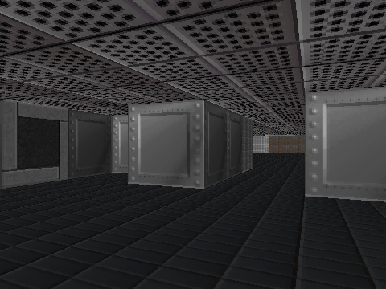

## VoidBlade

The project is currently at the beginning of its development.

One of my personal goals in programming is to create my own first person shooter game from 90s similar to DOOM. Without any shortcuts and just using [SDL](https://github.com/libsdl-org/SDL) with pure C.

For now I rendered wall and ceiling textures with ray casting:



### Build & Run

```bash
$ make
```

Binary is in the root directory:

```bash
$ ./voidblade
```
